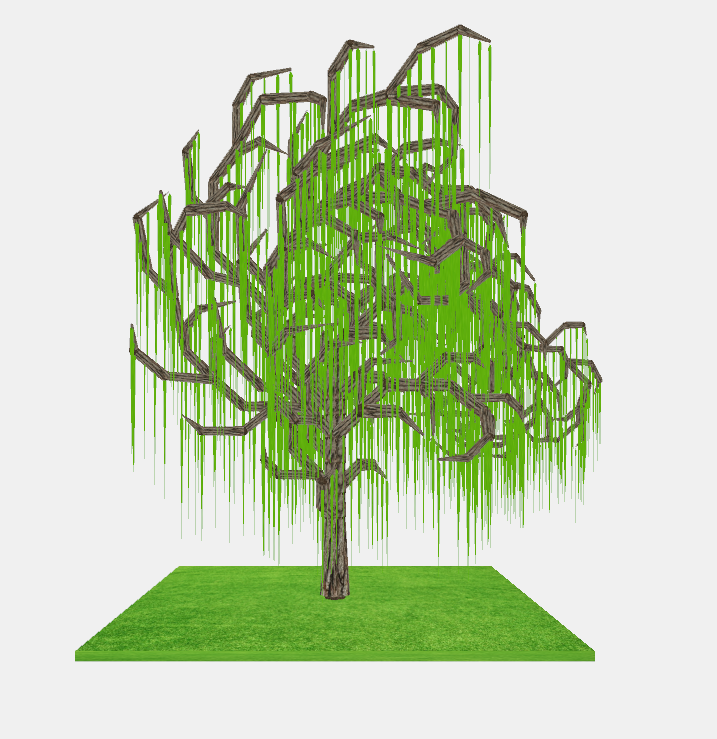
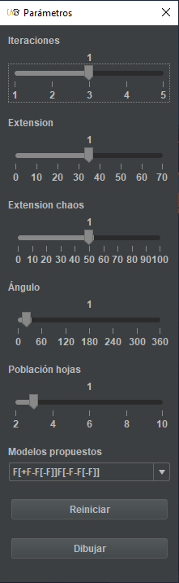

# Representación del Sauce llorón (Salix babylonica)
:office: Universidad de Huelva (UHU)  
:calendar: Curso 2019-2020  
:mortar_board: Realidad Virtual  
:octocat: [Ihar Myshkevich (@IgorMy)](https://github.com/IgorMy)  
:octocat: [Víctor M. Rodríguez Navarro (@Narovik)](https://github.com/Narovik)

#### Dependencias
* [uibooster-for-processing](https://github.com/milchreis/uibooster-for-processing)

  

## Introducción
En el presente repositorio se ha desarrollado una representación en Processing[1] del sauce llorón usando L-System[2].

  

## Estructura del proyecto
El proyecto se ha dividido en 4 ficheros. 
* lsystems: fichero principal del prpoyecto que contiene los metodos **draw()** y **setup()**
* class_LSystem: fichero que contiene todo el desarrollo del L-System
* Tree: fichero que contiene los metodos que dibujan el arbol
* Form_interface: fichero que contiene el metodo que genera la interfaz de UiBooster[3].

## Interfaz de UiBooster
* Iteraciones: número de iteraciones en la gramática de L-System.
* Extension: lonitud máximo de la rama.
* Extension chaos: alteración randomizada de la longitud de la rama.
* Angulo: alteración de los angulos del arbol (Experimental).
* Población hojas: Numero de hojas por rama.
* Modelos propuestos: Reglas de producción propuestas.

    

## Controles de la camara
* **W** : Acercar la camara al modelo.
* **S** : Alejar la camara del modelo.
* **A** : Girar la camara a la izquierda.
* **D** : Girar la camara a la derecha.
* **R** : Reiniciar la posición de la camara.
* **↑** : Mover la camara hacia arriba.
* **↓** : Mover la camara hacia abajo.
* **←** : Mover la camara hacia la izquirda.
* **→** : Mover la camara hacia la derecha.

## Simbolos de L-System
* **F** : Dibujar una rama.
* **+** : Rotar a la izquierda.
* **-** : Rotar a la derecha.
* **[** : Inicio de una nueva Rama.
* **]** : Final de la rama

## Referencias
* Para la generación del L-System se ha usado como base el trabajo de **They Did magazine**[4]. 
* Para la representacion de las ramas se han usado conos descritos en el artículo *Drawing a Cylinder with Processing*[5] de **Jan Vantomme**.
* Para la interfaz se ha usado *UiBooster* de **Milchreis**[3].

## Bibliografia
1. [Processing](https://processing.org/)
2. [Definición de L-System](https://es.wikipedia.org/wiki/Sistema-L)
3. [UiBooster](https://github.com/milchreis/uibooster-for-processing)
4. [L-System de They Did magazine](http://www.erase.net/projects/l-systems/)
5. [Drawing a Cylinder with Processing](https://vormplus.be/full-articles/drawing-a-cylinder-with-processing)
